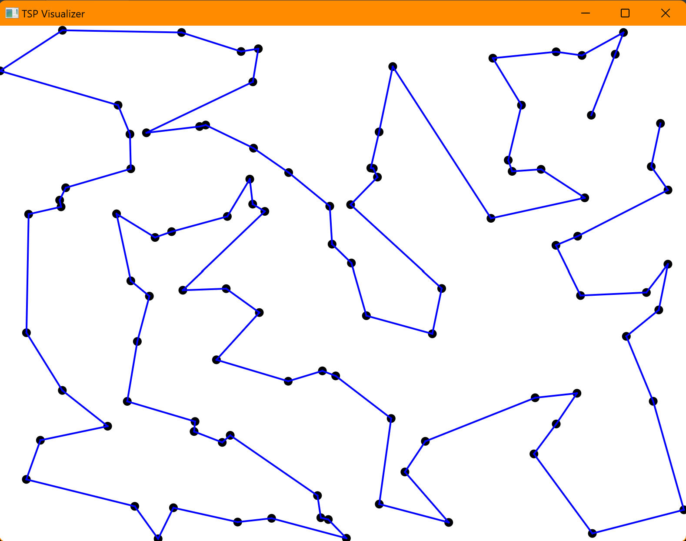

# Graphical TSP Solver

This repository contains a JavaFX application that generates and visualizes an approximate solution to the Traveling Salesman Problem (TSP) using several algorithms, including Kruskal's algorithm, Dijkstra's algorithm, Preorder Tree Walk, and 2-opt optimization.

## Features

- Generate a set of random cities.
- Construct a graph with weighted edges representing distances between cities.
- Create an approximate TSP path using Kruskal's algorithm (Minimum Spanning Tree), Dijkstra's algorithm, and Preorder Tree Walk.
- Optimize the TSP path using the 2-opt algorithm.
- Visualize the TSP solution with an animated step-by-step representation.

## Requirements

- Java 11 or higher
- JavaFX 17 or higher
- Maven

## Installation

1. Clone the repository:

git clone https://github.com/solotov-val/graphicaltsp.git
cd graphical-tsp

2. Build the project with Maven:

mvn clean install

3. Run the application:

mvn javafx:run

## Usage

1. Run the application as described in the Installation section.
2. The application will generate a set of random cities and display them on the screen.
3. Press the "Start" button to start the TSP solution process.
4. Watch the animated visualization of the TSP solution.

## License

This project is licensed under the [MIT License](LICENSE).
